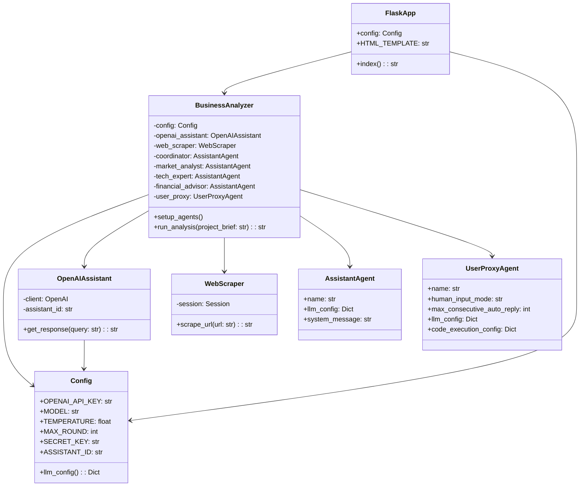
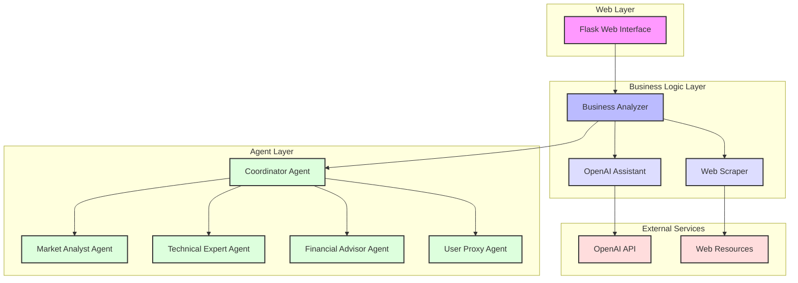

# Autogen Swarm Business Analyzer
[](https://opensource.org/licenses/MIT)
[](https://www.python.org/downloads/)
[](https://openai.com)
[](https://flask.palletsprojects.com/)
[](https://getbootstrap.com/)
[](https://github.com/backyMacky/Autogen-Swarm-b/issues)
[](https://github.com/backyMacky/Autogen-Swarm-b/stargazers)
[](https://github.com/backyMacky/Autogen-Swarm-b/network/members)
[](https://github.com/backyMacky/Autogen-Swarm-b/graphs/commit-activity)
[](http://makeapullrequest.com)

A "sophisticated" business analysis tool that leverages multiple AI agents to provide comprehensive business insights. The system uses OpenAI's GPT models and AutoGen framework to simulate a team of business experts analyzing your project or business idea.

Live Demo: [[Demo link](http://77.160.195.198:88/)]

<a href="https://www.buymeacoffee.com/bloombrine" target="_blank"></a>

## Features

- 🤖 **Multi-Agent Analysis System**
  - Market Analysis Expert
  - Technical Expert
  - Financial Advisor
  - Coordination Agent

- 🧠 **Comprehensive Analysis Coverage**
  - Market size and potential
  - Technical feasibility
  - Financial projections
  - Risk assessment

- 🌐 **Web Interface**
  - Clean, responsive design
  - Easy project brief submission
  - Formatted analysis results
  - Bootstrap-based UI

## Prerequisites

- Python 3.9+
- OpenAI API key
- OpenAI Assistant ID

## Architecture


## Quick Start

1. Clone the repository:
```bash
git clone https://github.com/backyMacky/Autogen-Swarm-b.git
cd Autogen-Swarm-b
```

2. Create and activate a virtual environment:
```bash
python -m venv env
source env/bin/activate  # On Windows: env\Scripts\activate
```

3. Install required packages:
```bash
pip install flask openai autogen beautifulsoup4 requests markdown bleach
```

4. Set up your OpenAI API key and Assistant ID in `Config` class

5. Run the application:
```bash
python SwarmOnline.py
```

6. Open your browser and navigate to:
```
http://localhost:5000
```

## Configuration

Update the `Config` class in SwarmOnline.py:
```python
@dataclass
class Config:
    OPENAI_API_KEY: str = os.getenv('OPENAI_API_KEY', 'your-api-key-here')
    MODEL: str = "gpt-4o-mini"  # Your preferred model
    TEMPERATURE: float = 0.7    
    MAX_ROUND: int = 10        
    SECRET_KEY: str = field(default_factory=lambda: os.getenv('SECRET_KEY', 'secret-key'))
    ASSISTANT_ID: str = field(default_factory=lambda: os.getenv('ASSISTANT_ID', ''))
```

## How It Works

1. **Input**: Submit your project brief through the web interface
2. **Analysis**: Multiple AI agents analyze different aspects:
   - Market Analysis
   - Technical Assessment
   - Financial Analysis
   - Coordinated Insights
3. **Output**: Receive a comprehensive analysis in formatted Markdown

## Process Flow


## Contributing

1. Fork the repository
2. Create your feature branch (`git checkout -b feature/YourFeature`)
3. Commit your changes (`git commit -m 'Add some feature'`)
4. Push to the branch (`git push origin feature/YourFeature`)
5. Open a Pull Request

## License

This project is licensed under the MIT License - see the [LICENSE](LICENSE) file for details.

## Documentation and Tutorials

- [AutoGen Documentation](https://microsoft.github.io/autogen/0.2/docs/Getting-Started/)
- [Flask Documentation](https://flask.palletsprojects.com/en/2.3.x/)
- [Bootstrap Documentation](https://getbootstrap.com/docs/5.3/getting-started/introduction/)

## Related Projects

- [OpenAI's Swarm](https://github.com/openai/swarm)
- [AgentScan: Multi-Agent Observability](https://github.com/The-Swarm-Corporation/agentscan)

## Community and Support

- [AutoGen Discord Community](https://discord.gg/pAbnFJrkgZ)
- [Flask Mailing List](https://mail.python.org/mailman/listinfo/flask)

## Acknowledgments

- [OpenAI](https://openai.com) for GPT models
- [Microsoft AutoGen Framework](https://microsoft.github.io/autogen/0.2/)
- [Flask Framework](https://flask.palletsprojects.com/)
- [Bootstrap](https://getbootstrap.com/) for UI components

## Support

For issues and feature requests, please use the [GitHub Issues](https://github.com/backyMacky/Autogen-Swarm-b/issues)

---

Made with ❤️ by [Martin Bacigal](https://github.com/backyMacky)
