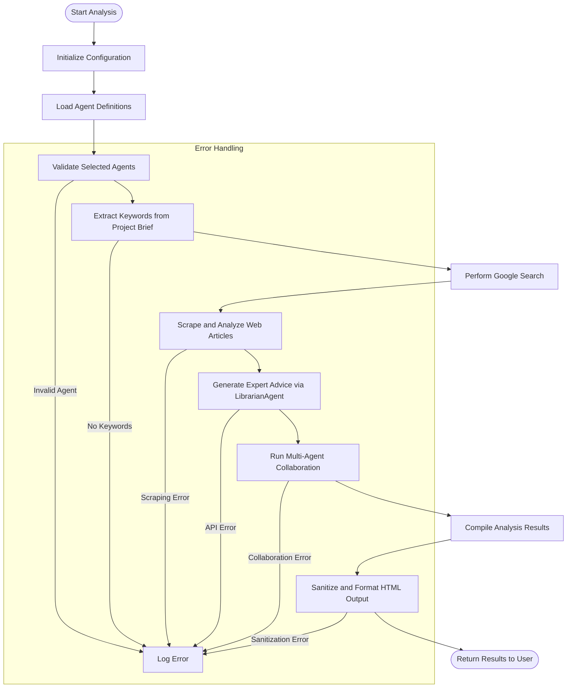

# AI Business Analyzer

**AI Business Analyzer** is a sophisticated Python application designed to perform comprehensive business analysis using multiple AI agents. Leveraging web scraping, keyword analysis, and OpenAI integrations, this system provides data-driven insights to aid in business decision-making processes.

## Table of Contents

- [Features](#features)
- [Architecture](#architecture)
- [Process Flow](#process-flow)
- [Installation](#installation)
- [Configuration](#configuration)
- [Usage](#usage)
- [API Endpoints](#api-endpoints)
- [Contributing](#contributing)
- [License](#license)
- [Potential Improvements](#potential-improvements)

## Features

- **Web Scraping:** Fetches and analyzes content from trusted sources to gather relevant business information.
- **Keyword Analysis:** Extracts and scores keywords to optimize web searches related to business briefs.
- **AI Integration:** Utilizes OpenAI's GPT-4 for generating expert advice and handling natural language processing tasks.
- **Multi-Agent System:** Employs various agents like `LibrarianAgent` and `UserProxyAgent` to collaborate on business analysis.
- **Progress Monitoring:** Tracks and logs the progress of analysis stages for transparency and debugging.
- **Flask Web Interface:** Provides a user-friendly web interface for submitting business briefs and viewing analysis results.
- **Comprehensive Logging:** Maintains detailed logs for all operations, aiding in monitoring and troubleshooting.
- **Security Enhancements:** Implements input validation, sanitization, and rate limiting to ensure secure operations.

## Architecture

The system is composed of several interconnected modules, each responsible for specific functionalities. Below is the high-level architecture diagram.

```mermaid
graph TD
    A[User Interface (Flask App)] --> B[BusinessAnalyzer]
    B --> C[WebScraper]
    B --> D[KeywordAnalyzer]
    B --> E[OpenAIAssistant]
    B --> F[LibrarianAgent]
    F --> G[OpenAI API]
    B --> H[AgentFactory]
    H --> I[Agent Definitions (agents.json)]
    B --> J[ProgressMonitor]
    B --> K[Logging System]
```

```mermaid
flowchart TD
    Start([Start Analysis]) --> A[Initialize Configuration]
    A --> B[Load Agent Definitions]
    B --> C[Validate Selected Agents]
    C --> D[Extract Keywords from Project Brief]
    D --> E[Perform Google Search]
    E --> F[Scrape and Analyze Web Articles]
    F --> G[Generate Expert Advice via LibrarianAgent]
    G --> H[Run Multi-Agent Collaboration]
    H --> I[Compile Analysis Results]
    I --> J[Sanitize and Format HTML Output]
    J --> End([Return Results to User])
    
    subgraph Error Handling
        C --> |Invalid Agent| X[Log Error]
        D --> |No Keywords| X
        F --> |Scraping Error| X
        G --> |API Error| X
        H --> |Collaboration Error| X
        J --> |Sanitization Error| X
    end
```

nstallation
Prerequisites
Python 3.8+
Git
Clone the Repository
bash
Copy code
git clone https://github.com/yourusername/ai-business-analyzer.git
cd ai-business-analyzer
Create a Virtual Environment
bash
Copy code
python -m venv venv
source venv/bin/activate  # On Windows: venv\Scripts\activate
Install Dependencies
bash
Copy code
pip install -r requirements.txt
Configuration
The application relies on several environment variables for configuration. Create a .env file in the root directory and populate it with the required variables:

env
Copy code
OPENAI_API_KEY=your-openai-api-key
SECRET_KEY=your-flask-secret-key
ASSISTANT_ID=your-assistant-id
VECTOR_STORE_IDS=vs_id1,vs_id2,vs_id3
GOOGLE_API_KEY=your-google-api-key
GOOGLE_SEARCH_ENGINE_ID=your-google-search-engine-id
Note: Do not commit your .env file to version control. Use .env.example as a template.

Usage
Running the Application
bash
Copy code
python app.py
The Flask application will start on http://0.0.0.0:5000/. Navigate to this URL in your web browser to access the interface.

Submitting a Business Brief
Access the Web Interface: Open your browser and go to http://localhost:5000/.
Fill in the Form:
Project Brief: Enter a detailed description of your business project.
Model Configuration: Optionally, select the AI model, temperature, and maximum number of conversation rounds.
Select Agents: Choose the agents you want to involve in the analysis.
Submit: Click the "Analyze" button to start the analysis.
View Results: The analysis results will be displayed in a structured and formatted manner.
Monitoring Progress
Access the progress endpoint to monitor the current status of the analysis:

http
Copy code
GET /progress
This endpoint returns a JSON response detailing the current stage, recent activities, and overall progress.

API Endpoints
GET /
Description: Renders the main web interface with the analysis form.
Parameters: None
Response: HTML page with the analysis form.
POST /
Description: Handles form submissions to initiate business analysis.
Parameters: Form data including project_brief, model, temperature, max_round, and selected_agents.
Response: JSON object containing the analysis result or error details.
GET /progress
Description: Retrieves the current progress status of the ongoing analysis.
Parameters: None
Response: JSON object with progress details.
Contributing
Contributions are welcome! Please follow the guidelines below to contribute to the project.

Steps to Contribute
Fork the Repository: Click the "Fork" button on the repository page to create a personal copy.

Clone the Forked Repository:

bash
Copy code
git clone https://github.com/yourusername/ai-business-analyzer.git
cd ai-business-analyzer
Create a New Branch:

bash
Copy code
git checkout -b feature/YourFeatureName
Make Changes: Implement your feature or bug fix.

Commit Changes:

bash
Copy code
git commit -m "Add your commit message"
Push to GitHub:

bash
Copy code
git push origin feature/YourFeatureName
Create a Pull Request: Navigate to the repository on GitHub and click "Compare & pull request."

Coding Standards
Follow PEP 8 style guidelines.
Write clear and concise commit messages.
Include docstrings and comments for complex logic.
Ensure that the code is well-tested before submission.
License
This project is licensed under the MIT License.
